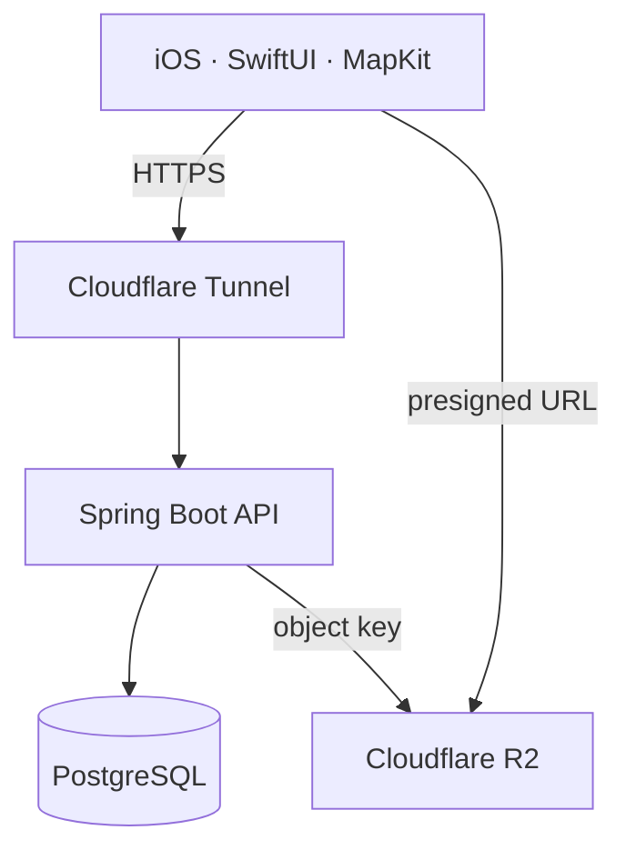

# CoCo

> 다른 러너의 코스를 경로와 현장 정보로 미리 확인하고, 나에게 맞는 러닝 코스를 선택하는 iOS 앱


| | |
|---|---|
| **기간** | 2026.07–현재 |
| **출발** | Apple Developer Academy AI Playground 4일 팀 활동 |
| **이후 개발** | iOS·서버·배포 개인 개발 |
| **상태** | MVP 기능 완료, 품질 강화 및 TestFlight 준비 중 |
| **운영 API** | `api.cocorun.site` |

---

## 사용 흐름

1. 지도와 코스 목록에서 달려 보고 싶은 코스를 찾습니다.
2. 경로 위의 경관·주의·편의 요소를 확인해 실제로 달릴지 판단합니다.
3. 코스를 스크랩하거나 반응을 남기고 보관함에서 다시 찾습니다.
4. MapKit 경로 계획, GPX 가져오기 또는 자유 그리기로 내 코스와 요소를 등록합니다.

<!-- TODO: 탐색 → 코스 선택 → 요소 상세 → 코스 등록 흐름의 스크린샷 3장과 10초 안팎 GIF 추가 -->

---

## 왜 만들었나

AI Playground에서 팀과 함께 **“러닝을 하던 사람이 다양한 코스 경험을 통해 질리지 않고 계속 뛰게 하자”**를 챌린지로 정했습니다. 처음에는 새로운 코스를 많이 보여주는 기능부터 떠올렸지만, 질문과 인터뷰를 거치며 러너가 낯선 코스를 선택하기 전에 **직접 가 보지 않고도 경로와 현장 맥락을 판단할 정보**가 필요하다는 문제로 좁혔습니다.

| CBL 과정 | 확인한 내용 | 제품에 반영한 결정 |
|---|---|---|
| **Engage** | 러너가 익숙한 코스에 머무르는 상황 | 다양한 코스를 지속적으로 경험하게 한다는 챌린지 정의 |
| **Investigate** | 새 코스를 고를 때 무엇이 궁금하고 걱정되는지 과거 경험 중심으로 질문 | 단순 추천보다 선택 전 판단에 필요한 정보가 중요하다고 정의 |
| **Act** | 코스 전체와 특정 지점의 경험을 함께 봐야 함 | 지도 경로 위에 경관·주의·편의 요소를 배치하는 구조 선택 |

이 과정에서 기능을 먼저 정하고 이유를 붙이던 방식의 한계를 느꼈습니다. 교육이 끝난 뒤에도 결과물을 버리지 않고, 팀에서 정한 문제와 컨셉을 기준으로 iOS 앱·Spring 서버·운영 환경을 개인 개발로 이어 갔습니다.

---

## 핵심 기능

- **코스 탐색** — 지도 영역과 텍스트로 코스를 좁히고 하프시트에서 비교합니다.
- **선택 전 판단** — 경로, 거리, 난이도와 함께 경관·주의·편의 요소의 위치와 설명을 봅니다.
- **개인 보관함** — 코스를 스크랩하고 내가 만든 코스와 반응을 계정별로 관리합니다.
- **세 가지 경로 생성** — MapKit 보행 경로, GPX 가져오기, 자유 그리기를 지원합니다.
- **요소 사진** — 앱에서 이미지를 축소·재인코딩하고 위치 등 식별 가능한 메타데이터를 제거한 뒤 업로드합니다.
- **게스트 우선 사용** — 로그인 화면 없이 시작하고, 이후 소셜 로그인으로 전환해 기존 코스·스크랩·반응을 이어 갑니다.

---

## 역할

| 단계 | 참여 방식 | 한 일 |
|---|---|---|
| **AI Playground 4일** | 팀 | Big Idea·챌린지 정의, 궁금점과 인터뷰 질문 검토, 패턴 분석, Solution Concept·프로토타입 논의 |
| **교육 이후** | 개인 | SwiftUI·MapKit 앱, Spring Boot API와 PostgreSQL 모델, 인증·소유권, 사진 저장소, 테스트·배포·운영 |

팀 활동에서 나온 문제 정의와 컨셉을 출발점으로 삼되, 교육 이후 추가한 기능과 기술 판단은 개인 개발 결과로 구분했습니다.

---

## 구조



- 일반 API는 Cloudflare Tunnel을 통해 Mac mini의 Spring 서버에 도달합니다.
- 사진 바이트는 서버를 통과하지 않고 iOS 앱이 presigned URL로 R2에 직접 올립니다.
- PostgreSQL과 관리 포트는 인터넷에 공개하지 않고, SSH·배포·장애 대응은 Tailscale 경로로 분리합니다.

---

## 핵심 판단

### 1. 코스 선과 경험 정보를 한 화면에 놓았습니다

코스 이름과 후기만 나열하면 러너가 어느 지점에서 무엇을 준비해야 하는지 알기 어렵습니다. 그래서 지도 위 경로와 경관·주의·편의 요소를 연결했습니다. 목록은 후보를 좁히고, 지도는 선택한 코스를 판단하는 역할로 나눴습니다.

### 2. 한 구간의 실패가 경로 전체를 지우지 않게 했습니다

MapKit은 여러 경유지를 한 번에 받지 않아 지점 사이마다 요청해야 합니다. 계산된 구간은 캐시하고 실패한 구간만 다시 요청하도록 구성했습니다. 지점 6개를 순서대로 추가할 때 요청 수는 매번 전체를 다시 계산하는 15회가 아니라 **5회**이며, 중간 구간이 실패해도 성공한 경로는 지도에 남겨 사용자가 문제 지점만 고칠 수 있습니다.

### 3. 로그인보다 탐색을 먼저 열었습니다

첫 실행에서는 게스트 계정과 토큰을 발급해 바로 코스를 볼 수 있습니다. Naver·Kakao 로그인 시에는 서버가 기존 게스트의 코스·스크랩·반응을 하나의 트랜잭션에서 회원 계정으로 승계합니다. 코스와 요소의 소유자는 클라이언트 입력이 아니라 인증 토큰으로 결정합니다.

### 4. 사진 전송과 저장 책임을 나눴습니다

앱은 원본 사진을 긴 변 1600px 기준으로 줄이고 JPEG로 다시 인코딩합니다. 서버는 크기·형식·소유권을 검사하고 짧게 유효한 업로드 URL만 발급합니다. 객체 저장소 자격 증명이 없어도 서버는 기동하며 사진 API만 명시적인 `503`을 반환합니다.

결정의 대안과 트레이드오프는 [DECISIONS.md](DECISIONS.md)에 정리했습니다.

---

## 검증 기록

마지막 개발 기록 기준으로 다음을 확인했습니다.

| 영역 | 확인 결과 |
|---|---|
| **iOS** | 단위 테스트 76개 통과, Dynamic Type·VoiceOver·라이트/다크·Increase Contrast 점검 |
| **서버** | 통합 테스트 41개 통과, 인증·소유권·사진 업로드/확정/교체/삭제 포함 |
| **경로 계산** | 캐시, 구간 실패, 재시도, 취소, 지점 25개, 자유 그리기 시나리오 검증 |
| **운영** | R2 발급→업로드→확정→조회→코스 삭제 왕복 및 재부팅 후 복구 확인 |

세부 변경과 당시 실행 결과는 [RESULT.md](RESULT.md)에 시간순으로 남겼습니다.

---

## 현재 범위와 남은 일

- MVP 핵심 기능과 V2의 소셜 로그인·정밀 경로·요소 사진은 구현했습니다.
- TestFlight 내부·외부 배포 절차는 아직 완료하지 않았습니다.
- 공개 App Store 출시는 현재 버전의 범위에 포함하지 않았습니다.
- GPS 기록, 실시간 내비게이션, 크루, 날씨 표현은 검증 없이 기능을 늘리지 않기 위해 [BACKLOG.md](BACKLOG.md)에 보류했습니다.

---

## 문서

| 문서 | 내용 |
|---|---|
| [SPEC.md](SPEC.md) | 제품 목표, 범위, 확인 시나리오, 완료 기준 |
| [DECISIONS.md](DECISIONS.md) | 오래 유지되는 설계 결정과 대안 |
| [RESULT.md](RESULT.md) | 구현·검증 결과의 시간순 기록 |
| [DEPLOYMENT.md](DEPLOYMENT.md) | Mac mini, Cloudflare, Tailscale, 백업 운영 절차 |
| [BACKLOG.md](BACKLOG.md) | 아직 확정하지 않은 후속 문제와 기능 후보 |

---

## 로컬 실행

### 서버

```bash
docker compose up -d postgres
cd server
./gradlew bootRun
```

로컬 기본값은 `localhost:5432/coco`이며 Flyway가 스키마를 적용합니다. 사진 저장소 설정이 비어 있어도 서버와 사진 외 기능은 실행됩니다.

### iOS

1. macOS에서 `CoCo.xcodeproj`를 Xcode로 엽니다.
2. iOS 26.2 이상 시뮬레이터 또는 서명된 실기기를 선택합니다.
3. Debug 빌드를 실행합니다. Debug의 API 주소는 `http://localhost:8080`입니다.

```bash
cd server && ./gradlew test
```

iOS 테스트는 Xcode의 `Product > Test`에서 실행합니다. macOS와 Xcode가 없는 환경에서는 iOS 빌드·실행을 검증할 수 없습니다.
